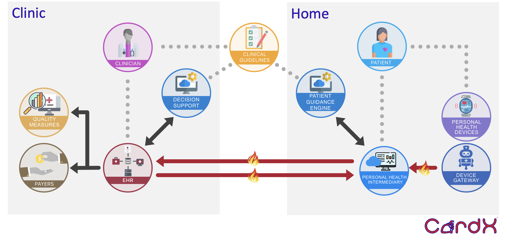

# CardX: Hypertension Management

>

### Objective

The objective of this implementation guide is to create an integrated standard that enables interoperable, scalable, and accessible hypertension management both at home and in the clinic. We aim to define the methodology to enable data liquidity between home blood pressure measurement devices, personal health intermediaries, and health systems.

This can potentially improve the awareness of guidelines, identification of disease, and management of individuals with hypertension and increase the proportion of individuals with hypertension who are treated to goal.

### Background

- Hypertension affects 115 million adults in America. 
    - 85% of African-Americans will develop hypertension in their lifetime. 
- There is a lack of adherence to clinical guidelines to diagnose, treat, and manage hypertension. 
    - Over 30% of people do not know that they have hypertension 
    - Only 25% of patients with a diagnosis of hypertension achieve blood pressure control.

Home blood pressure monitoring is the standard for hypertension monitoring, but there are no standards for interoperability to capture and exchange data from home blood pressure monitoring, the health system, and a personal health record.

Housed within the CodeX member-driven HL7 FHIR Accelerator, the mission of CardX (Cardiovascular data eXchange) is to engage a diverse group of stakeholders in the cardiovascular domain to enable standards-based interoperability in cardiovascular health and healthcare.

### HTN Management Goals 

- Create integrated, automated, vendor-agnostic hypertension standards by developing FHIR resources and open APIs that enable interoperable, scalable, and accessible hypertension management both at home and in the clinic
- Define the methodology to enable data liquidity between **home blood pressure measurement devices**, **Personal Health Intermediaries**, and **EHR devices**.
- Harmonize HTN vocabulary (demographics, VS, diagnoses, assessments, labs, meds, care plan)
- Develop device data exchange standards (“plug and play”) for:
    - Home BP device data
    - Communication between patient-facing and clinician EHR systems

A narrative example of a patient journey and use case for this implementation guide is in the [Use Cases](use-cases.md) page.

### Desired Impact 

- Decrease clinician burden.
- To improve the awareness of guidelines, identification of disease, and management of individuals with hypertension.
- Increase the proportion of individuals with hypertension who are treated to goal. 
- Increase data liquidity between blood pressure measurements captured at home with those captured in the clinic.
- Personal Health Intermediaries will be able to easily send and receive data to enhance a patient's ability to be part of their own care team. 
- EHR vendors will enable a service that will help clinicians treat patients.

### Contact Information

To learn more about CardX, visit https://confluence.hl7.org/display/COD/Cardiovascular